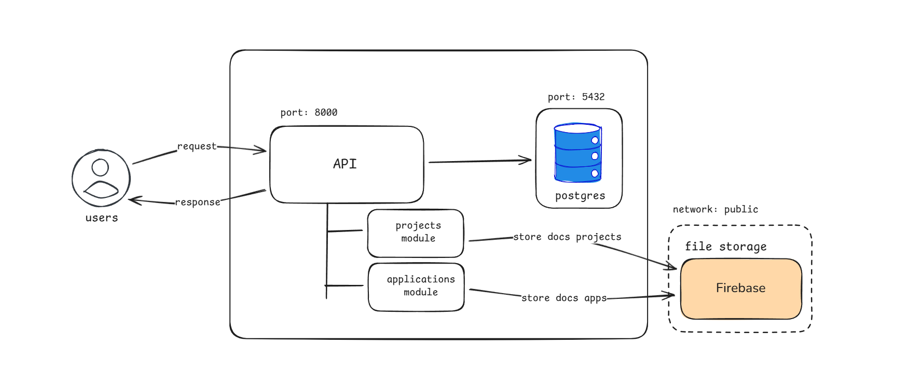

# go-mono-project

A monolithic RESTful API for project monitoring.

## Tech Stack

- Golang : https://github.com/golang/go
- PostgreSQL (Database) : https://github.com/postgres/postgres

## Framework & Library

- Echo : https://github.com/labstack/echo
- Golang Migrate (Database Migration) : https://github.com/golang-migrate/migrate
- Pgx (PostgresSQL Driver and Toolkit) : https://github.com/jackc/pgx

## Features

- Monolithic architecture
- Role-based access control security system
- JWT Authentication
- CRUD management such as user, project, and app

## Database Migration

All database migration is in `migrations` folder.

## Status

This project is under active development and is used as a learning and
mini project to explore backend system design with Golang.
